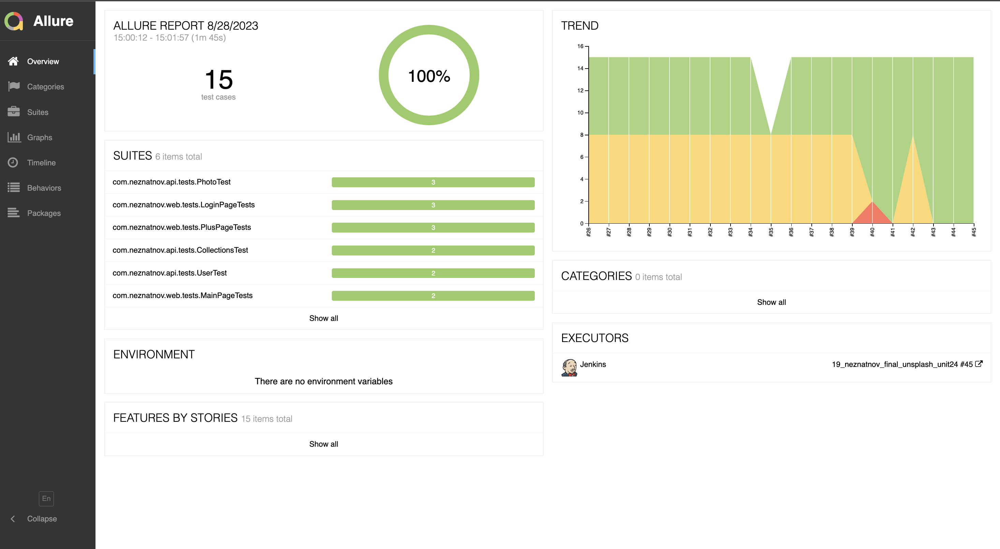
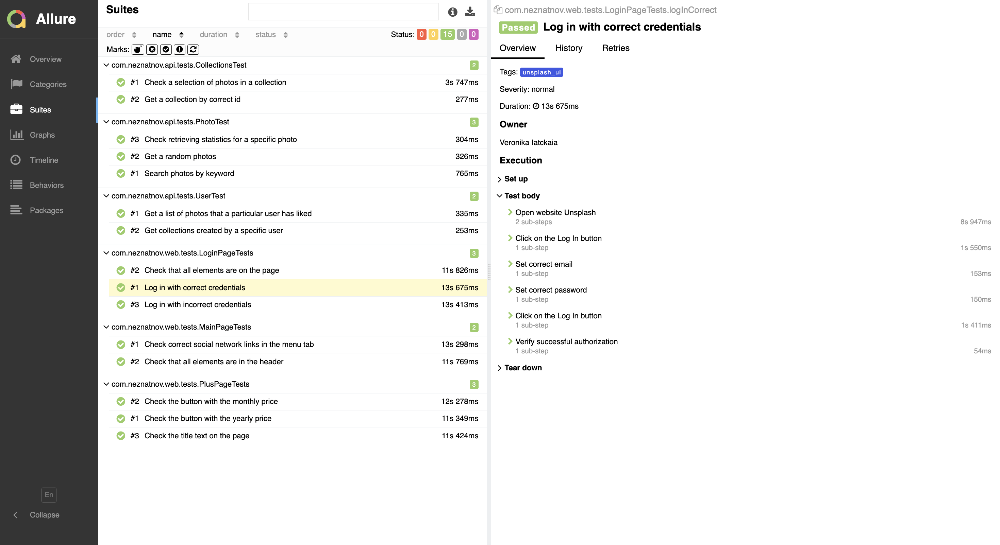
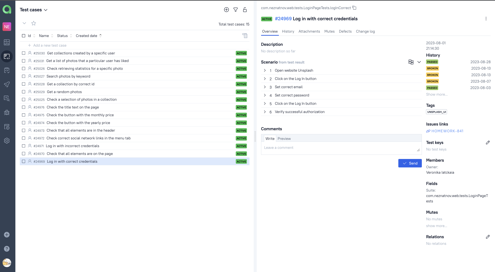
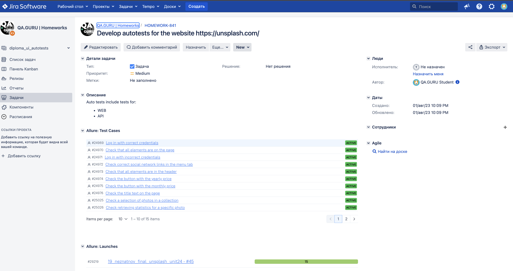

# Test automation project for the [unsplash.com](https://unsplash.com/) website
Unsplash is a platform powered by an amazing community that has gifted hundreds of thousands of their own photos to fuel creativity around the world.
## Table of contents


- [Stack of technologies](#computer-stack-of-technologies)
- [List of UI tests](#list-of-ui-tests)
- [List of API tests](#list-of-api-tests)
- [Running tests on a local machine](#running-automated-tests-on-a-local-machine)
- [Running tests in Jenkins](#running-tests-in-jenkins)
- [Test results report in Allure Report](#test-results-report-in-allure-report)
- [Integration with Allure TestOps](#integration-with-allure-testops)
- [Integration with Jira](#integration-with-jira)
- [Telegram notifications using a bot](#telegram-notifications-using-a-bot)
- [Example of test execution in Selenoid](#example-of-test-execution-in-selenoid)


## :computer: Stack of technologies
<div style="text-align: center;">
<a href="https://jetbrains.com/idea/"></a>
<a href="https://java.com/"></a>
<a href="https://junit.org/junit5/"></a>
<a href="https://selenide.org/"></a>
<a href="https://rest-assured.io/"></a>
<a href="https://gradle.org/"></a>
<a href="https://github.com/"></a>
<a href="https://jenkins.io/"></a>
<a href="https://github.com/allure-framework/allure2"></a>
<a href="https://aerokube.com/selenoid/"></a>
<a href="https://qameta.io/"></a>  
<a href="https://www.atlassian.com/software/jira"></a>  
</div>
In this project, the automated tests are written in <code>Java</code> using the <code>Selenide</code> framework. <code>Gradle</code> is used to build the project. <code>JUnit 5</code> is used as the unit testing framework. <code>Rest-assured</code> library was used for API tests. The tests are run from <code>Jenkins</code>. After the run is completed, a notification is sent using a bot on Telegram. <code>Selenoid</code> is used to run browsers in Docker containers. Integration with <code>Allure TestOps</code> and <code>Jira</code> is set up for test reporting and test result analytics.

## List of UI Tests
- [x] Check that all elements are on the page
- [x] Log in with correct credentials
- [x] Log in with incorrect credentials
- [x] Check correct social network links in the menu tab
- [x] Check that all elements are in the header
- [x] Check the button with the monthly price
- [x] Check the title text on the page
- [x] Check the button with the yearly price

## List of API tests
- [x] Check a selection of photos in a collection
- [x] Get a collection by correct id
- [x] Get a random photos
- [x] Search photos by keyword
- [x] Check retrieving statistics for a specific photo
- [x] Get a list of photos that a particular user has liked
- [x] Get collections created by a specific user

## Running automated tests on a local machine
__Locally, from a terminal:__
```
gradle clean test
```
__Remotely, from Jenkins:__
```properties
clean
${TASK}
--info
-Dbrowser=${BROWSER}
-DbrowserVersion=${BROWSER_VERSION}
-DbrowserSize=${BROWSER_SIZE}
-DbaseUrl=${BASE_URL}
-Denv=${env}
```

>- <code>BROWSER</code> - browser in which the tests will be run (Chrome is set by default)
>- <code>BROWSER_VERSION</code> - the browser version in which the tests will be run.(The default is 100.00)
>- <code>BROWSER_SIZE</code> - size of the browser window (1920x1080 is set by default)
>- <code>BASE_URL</code> - the base URL of the web application under test
>- <code>env</code> - quick remote test launch configuration.

## Running tests in Jenkins
To run tests in Jenkins, follow these steps:
1. Click on the [provided link](https://jenkins.autotests.cloud/job/19_neznatnov_final_unsplash_unit24/)
2. Click the **Build with Parameters** link
3. Modify the parameters as needed
4. Click the **Build** button, and build will be started

<div style="text-align: center;">
  
</div>

## Test results report in [Allure Report](https://jenkins.autotests.cloud/job/19_neznatnov_final_unsplash_unit24/45/allure/)
The report of the test execution includes:
- Test steps
- Screenshot of the page on the last test step
- Page Source
- Browser console logs
- Video of the test run
<div style="text-align: center;">
  
</div>

<div style="text-align: center;">
  
</div>

## Integration with [Allure TestOps](https://allure.autotests.cloud/project/3603/dashboards)
<div style="text-align: center;">
  
</div>

## Integration with [Jira](https://jira.autotests.cloud/browse/HOMEWORK-841)
<div style="text-align: center;">
  
</div>

## Telegram notifications using a bot
After passing all the tests, an automatic report is sent to the Telegram messenger.
<div style="text-align: center;">
  
</div>

## Example of test execution in Selenoid
<div style="text-align: center;">
  
</div>